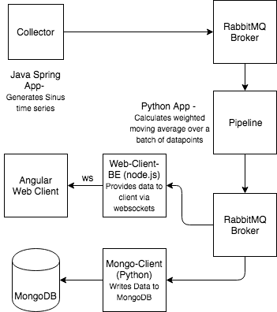

# IoT Telemetry Data Pipeline

This repository contains multiple services to build a pipeline for telemetry data like shown in the flow diagram below.



## Contained Services
### Collector
This is a Java Spring Boot application that provides the telemetry data and sends it to the RabbitMQ message broker. It generates Sinus curves with different frequencies close to the Nyquist frequency, so that Aliasing effects can be seen in the later visualization. Telemtry data is emitted every 50 milliseconds as an array of datapoints for the different time series and a timestamp in UTC epoch time in milliseconds since it is a simple data type, timezone independent and with sufficient time resolution.

### Pipeline
The generated data will then be transmitted to a pipeline for transformation. This is done by a Python app, which collects the datapoints from the message broker queue and calculates the moving average for a batch of datapoints. The average is linearly weighted to give the more recent datapoints a higher weight than the older ones.


with


After transformation the data is again transmitted to a queue in the message broker.

### Web-Client-Backend
This is a node.js application that takes the data from the broker and provides it to the web client via a websocket connection.

### MongoDB-Client
This is a simple Python application that takes the data from the broker and writes it to a MongoDB database.

### Web-Client
There is also an Angular web client to visualize the data as a chart.

## Installation Instruction
There is a docker-compose file provided to run the whole chain of services. But first you have to build all the relevant docker images. In every subdirectory of the previously described services you will find a readme with instructions on how to build the image. After having built all images simply run
```
docker-compose up
```
to start the whole chain. Since docker-compose does not provide a good way on starting services time delayed, there will occur some errors in the beginning when services can not connect to the broker since it is not ready yet. They will then simply restart and try to reconnect until everything is ready. In the compose file you can specify the batch size for the moving average via an environment variable (BATCH_SIZE) for the pipeline service.

### Endpoints
There are several endpoints exposed to monitor the pipeline. Simply visit `http://localhost:PORT` 
- web-client: PORT=80
- RabbitMQ: PORT=8095
- MongoExpress: PORT=8081